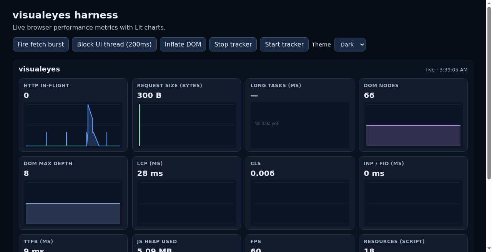
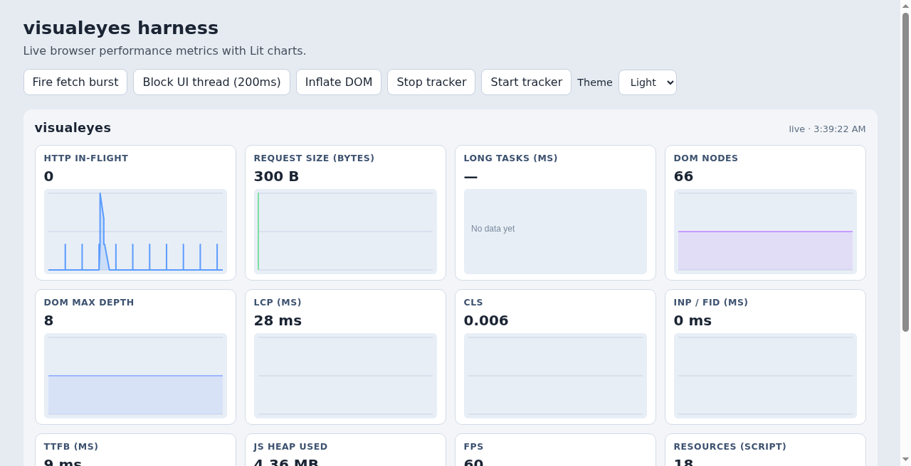

# pagepulse

[](https://www.npmjs.com/package/pagepulse)
[](https://www.npmjs.com/package/pagepulse)
[](https://www.typescriptlang.org/)
[](LICENSE)
[](https://github.com/Davidhanson90/pagepulse/actions/workflows/verify-main.yml)

`pagepulse` is an ESM TypeScript library for capturing browser performance metrics and rendering live Lit dashboard charts.

## Try the Demo

**Live demo:** <https://davidhanson90.github.io/pagepulse/>

Or run the harness locally:

```bash
npm install
npm start
```

Then open the local URL shown in your terminal (Vite default is usually `http://localhost:5173`).

## Features

- ESM package output with TypeScript declarations
- Tracker API for HTTP, long tasks, DOM, web vitals, memory, FPS, resources, LoAF, connection, navigation, and errors
- Reusable `<pagepulse-dashboard>`, `<pagepulse-chart>`, `<pagepulse-waterfall>`, and `<pagepulse-data-table>` web components
- Export latest gauges / time-series / resource rows as JSON or CSV (`downloadData`, `snapshotToTable`)
- Dark / light / auto theming via a `theme` attribute and `--pagepulse-*` CSS variables
- Soft-failing collectors when browser APIs are unavailable

## Installation

```bash
npm install pagepulse
```

## Usage

### 1. Import the library

```ts
import { createTracker } from "pagepulse";
```

Importing `pagepulse` registers the Lit custom elements.

### 2. Create and start a tracker

```ts
const tracker = createTracker({
  sampleIntervalMs: 1000,
  retentionMs: 5 * 60 * 1000,
  collectors: {
    http: true,
    longTasks: true,
    dom: true,
    webVitals: true,
    memory: true,
    fps: true,
    loaf: true,
    connection: true,
    navigation: true,
    errors: true
  }
});

tracker.start();
tracker.subscribe((snapshot) => {
  console.log(snapshot.latest);
});
```

### 3. Render the dashboard

```html
<pagepulse-dashboard id="dash" theme="dark"></pagepulse-dashboard>
```

`theme` accepts `dark` (default), `light`, or `auto` (follow `prefers-color-scheme`).

```ts
const dash = document.getElementById("dash");
if (dash) {
  dash.tracker = tracker;
}
```

If you do not set `.tracker`, the dashboard uses the default tracker from the latest `createTracker()` call.

### 4. Stop tracking

```ts
tracker.stop();
```


### 5. Resource waterfall

`<pagepulse-waterfall>` renders a horizontal Resource Timing timeline (one row per resource). It is included under the metric grid on `<pagepulse-dashboard>`, and can also be used standalone:

```html
<pagepulse-waterfall id="wf" theme="dark"></pagepulse-waterfall>
```

```ts
const tracker = createTracker({
  firstPartyDomains: ["static.example.com"], // optional allow-list (page host is always 1st-party)
  maxResourceEntries: 150
});
tracker.start();

const wf = document.getElementById("wf");
if (wf) {
  wf.tracker = tracker;
  wf.theme = "dark";
  // optional: wf.firstPartyDomains = ["static.example.com"];
}
```

**Legend**

| Visual | Meaning |
| --- | --- |
| Blue / purple / green / coral / gold / gray bars | Initiator: script, css/link, img, fetch/xhr, font, other |
| Striped bar | Third-party host |
| Light outline on bar | Cached heuristic (`transferSize === 0` with encoded/decoded body size) |

Hover a row (native `title` tooltip) for URL, type, duration, size, 1p/3p, and cached.

```ts
tracker.getResources();           // ResourceTimingRow[]
tracker.subscribeResources(cb); // unsubscribe function
tracker.clearResources();         // clear rolling buffer
```

Collector flag: `collectors.resources` (default `true`). Soft-fails when `PerformanceObserver` / Resource Timing is unavailable. Buffer clears best-effort on soft navigations (`soft-navigations` observer + `popstate`).

### 6. Raw data table & download

Build tabular payloads from a snapshot (or directly from the tracker) and trigger a browser download:

```ts
import {
  createTracker,
  snapshotToTable,
  seriesToTable,
  resourcesToTable,
  downloadData,
  tableToCsv
} from "pagepulse";

const tracker = createTracker();
tracker.start();

const gauges = tracker.getDataTable();
// { columns: ["metric","latest","description","pointCount","series"], rows: [...] }

const series = tracker.getSeriesTable(); // long-form: metric, t, v
const resources = tracker.getResourcesTable(); // Resource Timing rows

downloadData(gauges, { format: "json", filename: "pagepulse-metrics.json" });
downloadData(gauges, { format: "csv", filename: "pagepulse-metrics.csv" });

// Or build from a Snapshot you already have:
const snap = tracker.getSnapshot();
snapshotToTable(snap);
seriesToTable(snap);
resourcesToTable(tracker.getResources());
tableToCsv(gauges); // string
```

`downloadData` uses `Blob` + an object URL and soft-fails (returns `false`) when DOM download APIs are unavailable (e.g. Node). CSV requires a `DataTable` (`{ columns, rows }`); JSON accepts any serializable value.

#### `<pagepulse-data-table>`

```html
<pagepulse-data-table id="raw" theme="dark"></pagepulse-data-table>
```

```ts
const raw = document.getElementById("raw");
if (raw) {
  raw.tracker = tracker;
  raw.theme = "dark"; // or "light" | "auto"
}
```

The component shows a scrollable table of current metrics (name, latest value, description, point count, series JSON), with **Download JSON** / **Download CSV** buttons and a **Metrics / Resources** tab toggle. In the harness, enable **Show raw data table** in the toolbar.

## Metric title help

## Metric title help

Hover a dashboard panel title to see a short description of what that metric means. Descriptions also appear as the native browser tooltip via the `title` attribute.

## Theming


`pagepulse` ships two built-in visual themes — **dark** and **light** — plus **auto** to follow the OS.

### Theme previews

| Dark (`theme="dark"`) | Light (`theme="light"`) |
| --- | --- |
|  |  |

### Theme options

| Value | Result |
| --- | --- |
| unset / `dark` | Dark palette (default, original 0.1.0 look) |
| `light` | Full light palette |
| `auto` | Uses light when the OS prefers light (`prefers-color-scheme: light`), otherwise dark |

`<pagepulse-dashboard>`, `<pagepulse-chart>`, `<pagepulse-waterfall>`, and `<pagepulse-data-table>` accept a reflected `theme` attribute/property. The dashboard forwards `theme` to nested charts and the waterfall so colors stay in sync.

### How to enable a theme

**Option A — HTML attribute (simplest)**

```html
<!-- Dark (default if omitted) -->
<pagepulse-dashboard theme="dark"></pagepulse-dashboard>

<!-- Light -->
<pagepulse-dashboard theme="light"></pagepulse-dashboard>

<!-- Follow the user's OS preference -->
<pagepulse-dashboard theme="auto"></pagepulse-dashboard>
```

**Option B — JavaScript property**

```ts
import { createTracker } from "pagepulse";

const tracker = createTracker();
tracker.start();

const dash = document.querySelector("pagepulse-dashboard");
if (dash) {
  dash.tracker = tracker;
  dash.theme = "light"; // or "dark" | "auto"
}
```

**Option C — Try it in the harness**

```bash
npm install
npm start
```

Open the local URL, then use the **Theme** dropdown (Dark / Light / Auto) in the toolbar. That sets `theme` on the dashboard live.

### Customizing colors

Tokens live on `:host` and can be overridden per instance (works with any theme):

```html
<pagepulse-dashboard
  theme="light"
  style="--pagepulse-accent: #c026d3; --pagepulse-bg: #faf6ff;">
</pagepulse-dashboard>
```

| Variable | Role | Dark default | Light default |
| --- | --- | --- | --- |
| `--pagepulse-bg` | Host background | `#0b1220` | `#f3f5f8` |
| `--pagepulse-text` | Primary text | `#e8eef7` | `#1a2433` |
| `--pagepulse-muted` | Secondary text | `#8b9bb0` | `#5c6d82` |
| `--pagepulse-title` | Panel titles | `#9fb3c8` | `#3d5270` |
| `--pagepulse-panel-bg` | Panel surface | `#121a2b` | `#ffffff` |
| `--pagepulse-panel-border` | Panel border | `#243149` | `#d3dce8` |
| `--pagepulse-chart-bg` | Chart / canvas background | `#0d1524` | `#e8eef6` |
| `--pagepulse-grid` | Chart grid lines | `#1c2940` | `#c9d4e4` |
| `--pagepulse-status` | Header status text | `#9fb3c8` | `#5c6d82` |
| `--pagepulse-empty` | Empty-chart label | `#4a5a70` | `#7a8b9e` |
| `--pagepulse-accent` | Default series color | `#5b9cff` | `#2563eb` |

Canvas drawing reads these via `getComputedStyle` (background, grid, empty-state text, and the default series color when `color` is unset).

## Metrics

- `httpInFlight` — fetch / XHR wrappers
- `requestSize` — Resource Timing transfer/encoded size
- `longTaskDuration` — PerformanceObserver longtask
- `domNodeCount` / `domMaxDepth` — periodic DOM walk
- `lcp` / `cls` / `inp` / `ttfb` — web vitals
- `jsHeapUsed` / `jsHeapLimit` — `performance.memory` when present
- `fps` — requestAnimationFrame
- `resourceScript` / `resourceCss` / `resourceImg` / `resourceFetch` — resource counts
- `loafDuration` / `loafScriptDuration` / `loafStyleDuration` — Long Animation Frames (`PerformanceObserver` type `long-animation-frame`; Chromium)
- `connectionRtt` / `connectionDownlink` / `connectionEffectiveType` — Network Information API (`navigator.connection`; effectiveType ordinal 0–4)
- `navDomContentLoaded` / `navLoad` — Navigation Timing (hard navigation)
- `softNavCount` / `softNavDuration` — soft navigations via `soft-navigations` observer and `history` / `popstate` hooks
- `errorCount` / `rejectionCount` — cumulative `window` `error` and `unhandledrejection` counts

## Scripts

- `npm run build` - compile library to `dist/`
- `npm run test` - run Vitest tests
- `npm run test:coverage` - run tests with coverage reports in `coverage/`
- `npm run build:verify` - run coverage, lint, harness build, and typecheck
- `npm run pack:check` - show package contents using `npm pack --dry-run`

## Development

```bash
npm install
npm start
```

## License

MIT
